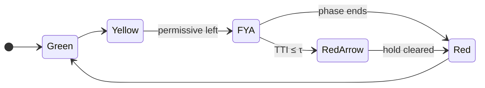

# Dynamic FYA Crest Controller

**Sensor-actuated phasing for blind-crest intersections.** 
Detect the hidden vehicle. Override the permissive turn. Before the gap is accepted.

 

[Problem](#the-problem) · [Approach](#approach) · [Model](#the-math) · [Hypotheses](#hypotheses) · [Case Study](#case-study) · [Structure](#repository-structure) · [Roadmap](#roadmap)

 

## The problem

A Flashing Yellow Arrow (FYA) assumes a left-turning driver can *see* oncoming traffic well enough to judge a gap. On a vertical crest curve, that assumption breaks: the hill hides the oncoming vehicle until it is too close to stop.

A fixed timer cannot react to this. It has no idea whether the car cresting the hill is doing 45 mph or 65.

## Approach

A virtual sensor at the crest measures each oncoming vehicle's speed. The controller converts that into a **Time-to-Intersection (TTI)** and compares it to a safety threshold. If the gap is unsafe, the permissive FYA is withheld and the signal moves to a **protected red arrow**. Otherwise, normal FYA operation continues, so delay stays low.

## The math

All geometry follows AASHTO conventions.

**1. Sight-distance constraint** (crest curve, $S < L$)

$$
L = \frac{A\,S^{2}}{100\left(\sqrt{2h_1}+\sqrt{2h_2}\right)^{2}}
$$

With $h_1 = 1.08\ \text{m}$ (passenger car eye height) and $h_2 = 0.60\ \text{m}$ (object height), this reduces to $L \approx A S^2 / 658$.

**2. Stopping sight distance**

$$
\mathrm{SSD} = 0.278\,v\,t_{pr} + \frac{v^{2}}{254\,(\mu \pm G)}
$$

The intersection is **blind** when available sight distance falls below SSD: $S_D < \mathrm{SSD}$.

**3. Controller trigger**

$$
\mathrm{TTI} = \frac{d_{sensor}}{v(t)} \le \tau, \qquad \tau = t_{clear} + t_{buffer}
$$

**4. Safety metric**

$$
\mathrm{TTC}_i(t) = \frac{x_{lead}(t) - x_{follow}(t) - l_{lead}}{v_{follow}(t) - v_{lead}(t)}
$$

A critical conflict is any event with $\mathrm{TTC} \le 1.5\ \text{s}$.

| Symbol | Meaning | Unit |
|:--|:--|:--|
| $A$ | Algebraic grade difference | % |
| $S_D$ | Available sight distance | m |
| $h_1,\ h_2$ | Driver eye height, object height | m |
| $v(t)$ | Instantaneous speed at the sensor | m/s |
| $d_{sensor}$ | Crest-to-intersection distance | m |
| $\tau$ | Clearance time plus safety